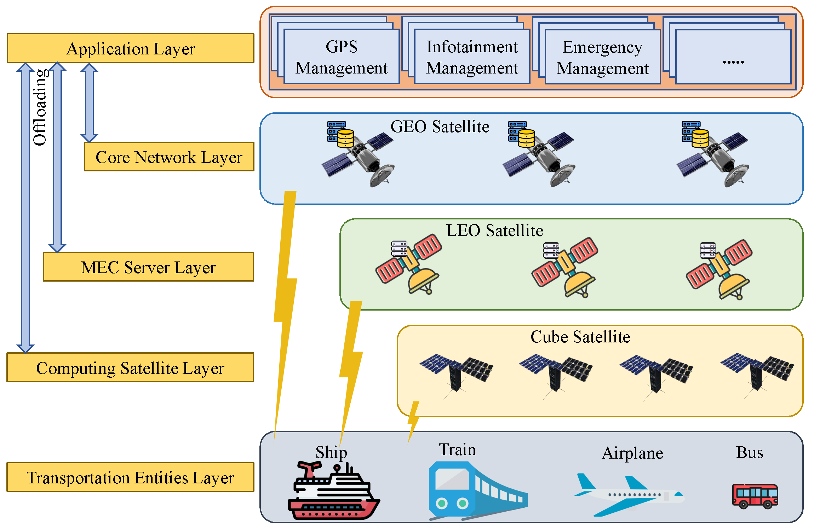
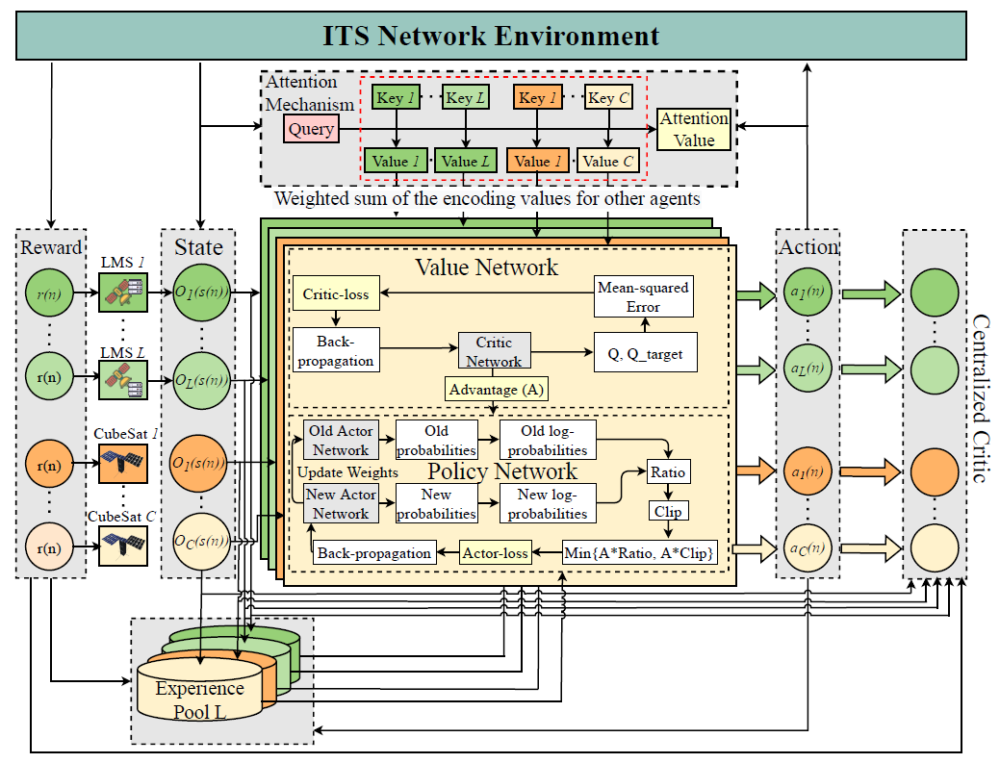

# MEC-enabled-Satellite-Network-System

## Overview
This is the Simulation code for MEC-Enabled Satellite Networks for ITS Data Offloading: A Cooperative Multi-Agent Proximal Policy Optimization DRL with Attention Approach

With the rapid growth of intelligent transportation systems (ITS), there is a growing need to support real-time network applications. However, terrestrial networks are insufficient to support diverse applications in the case of airplanes and ships. Meanwhile, satellite networks can be a great supplement to terrestrial networks regarding coverage, flexibility, and availability. Thus, we investigate a novel ITS data offloading service based on satellite networks, in which low-Earth orbit (LEO) and cube satellites are regarded as independent mobile edge computing (MEC) servers, responsible for scheduling the processing of ITS data generated by ITS nodes. We formulate a joint delay and rental price minimization problem for different satellite servers while optimizing offloading task selection, computing, and bandwidth resource allocation, which is mixed-integer non-linear programming (MINLP) and NP-hard. To deal with the problem's complexity, we divide the problem into two stages. Firstly, we proposed a cooperative multi-agent proximal policy optimization (Co-MAPPO) deep reinforcement learning (DRL) with an attention approach for determining offloading decisions to obtain quick convergence. Secondly, we break down the remaining subproblem into independent subproblems and find their optimal closed-form solutions. Extensive simulations are utilized to validate the proposed approach's effectiveness in comparison to baselines by 8.92\% and 3.14\% respectively.

## Version
- Unity 2020.3.25f1
- ML-agents Release 17
- python 3.8
- Pytorch 1.8.0

## License
Copyright (c) 2020 Networking Intelligence
Redistribution and use in source and binary forms, with or without modification, are permitted provided that the following conditions are met:

1. Redistributions of source code must retain the above copyright notice, this list of conditions and the following disclaimer.

2. Redistributions in binary form must reproduce the above copyright notice, this list of conditions and the following disclaimer in the documentation and/or other materials provided with the distribution.

THIS SOFTWARE IS PROVIDED BY THE COPYRIGHT HOLDERS AND CONTRIBUTORS "AS IS" AND ANY EXPRESS OR IMPLIED WARRANTIES, INCLUDING, BUT NOT LIMITED TO, THE IMPLIED WARRANTIES OF MERCHANTABILITY AND FITNESS FOR A PARTICULAR PURPOSE ARE DISCLAIMED. IN NO EVENT SHALL THE COPYRIGHT HOLDER OR CONTRIBUTORS BE LIABLE FOR ANY DIRECT, INDIRECT, INCIDENTAL, SPECIAL, EXEMPLARY, OR CONSEQUENTIAL DAMAGES (INCLUDING, BUT NOT LIMITED TO, PROCUREMENT OF SUBSTITUTE GOODS OR SERVICES; LOSS OF USE, DATA, OR PROFITS; OR BUSINESS INTERRUPTION) HOWEVER CAUSED AND ON ANY THEORY OF LIABILITY, WHETHER IN CONTRACT, STRICT LIABILITY, OR TORT (INCLUDING NEGLIGENCE OR OTHERWISE) ARISING IN ANY WAY OUT OF THE USE OF THIS SOFTWARE, EVEN IF ADVISED OF THE POSSIBILITY OF SUCH DAMAGE.
